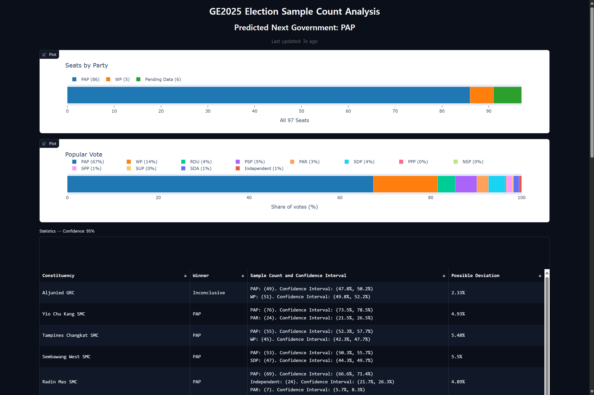

## Singapore Election Sample Analysis

Make statistically reliable predictions about the election using only Sample Count information.

> Disclaimer: This project is only for educational purposes. The derived results should not be counted as authoritative data.



---

## Problem
In larger countries such as the United States and South Korea, vote counting is a long and arduous process. These countries allow exit polls and live counting to help citizens monitor results as votes come in. Popular news agencies will sometimes “call” a race for a candidate when there is reasonable certainty (typically 95%) that the candidate will win.

In Singapore, vote counting happens overnight once polls close at 8 pm. Official results are progressively released through the night and into the early morning, especially for larger GRCs and for presidential elections. To reduce speculation during the counting process, the Elections Department (ELD) releases constituency Sample Counts to give citizens an early sense of results. However, key questions remain:

- How much can the Sample Count deviate from the actual final count?
- When is it statistically justified to project the winner of the constituency for a party to a certain level of confidence?

This project uses statistical analysis and publicly available information to compute uncertainty, form 95% confidence intervals, and determine when a projection is warranted to project the winner of the constituency.

## Guiding Question
From the Sample Count, can we calculate 95% confidence intervals for each party? 

With these intervals, can we:

- Project constituency winners at 95% confidence,
- Predict the total number of seats by party,
- Estimate national popular vote shares, and
- Identify which party will most likely form the next government

---

## Statistical Theory

### Sampling design as reported by ELD
For each constituency during a General Election, election officials take a Simple Random Sample (SRS) of 100 votes from each polling station and tally votes to each party/candidate. Because polling stations serve different numbers of voters, the constituency-level Sample Count is a weighted average of polling-station-level sample proportions, rounded to the nearest integer. This is naturally modeled as Stratified Simple Random Sampling (Stratified SRS): a constituency (population) is broken into polling stations (strata), and an SRS is taken within each stratum to estimate the constituency proportion.

### Stratified estimator and variance
Let there be $L$ strata (polling stations) indexed by $h=1,\dots,L$. 

Let $N_h$ be the size of stratum $h$, where $N=\sum_{h=1}^L N_h$. 

Let the constituency size, $n_h$ the sample size drawn from stratum $h$ (typically $n_h=100$)

Let $\hat p_h$ the sample proportion for a given party within stratum $h$, without loss of generality, even for n-party election race.

The stratified estimator of the constituency proportion is

$$
\hat p 
= \frac{1}{N} \sum_{h=1}^L N_h \, \hat p_h.
$$

Under stratified sampling, an estimator of its variance is

$$
s_{\hat p}^2 
= \sum_{h=1}^L \left(\frac{N_h}{N}\right)^2 
\left(\frac{N_h - n_h}{N_h - 1}\right) \frac{s_h^2}{n_h},
$$

where $\tfrac{N_h - n_h}{N_h - 1}$ is the finite-population correction (FPC) factor, and $s_h^2$ is the (within-stratum) sample variance for the indicator of a vote to the party. For a proportion, $s_h^2 = \hat p_h (1-\hat p_h)$.

ELD notes that the Sample Count can differ from the actual count by approximately 4 percentage points. However, we can usually do better statistically because:

1. With more strata (polling stations) and the same number sampled from each stratum, the total sample size increases, which alone improves precision.
2. Stratification tends to reduce within-stratum variability if strata are homogeneous (e.g., polling districts often group residents by similar housing types or demographics), yielding an additional precision gain.

---

## Assumptions and Simplifications
Because some granular inputs are not publicly available for every polling station, we adopt the following practical assumptions:

1. Each stratum has the same sample proportion, i.e., $\hat p_h = \hat p$ for all $h$. We have information about the sample proportion in a constituency, not at each polling station. 
2. A uniform sample size is taken within each stratum: $n_h=n=100$, as per ELD's protocol.
3. Each stratum has uniform size, i.e., $N_h = N/L$. The exact $N_h$ vary in practice, but detailed $N_h$ for every station are not published. Therefore $N = L\,N_h$. The number of polling stations for each constituency, $L$, can be counted from the Singapore eGazette during the election period.

Under these assumptions, the estimator simplifies to an equal-weight average of strata proportions:

$$
\hat p
= \frac{1}{N} \sum_{h=1}^L N_h \hat p_h
$$
$$
= \frac{1}{N} \sum_{h=1}^L \frac{N}{L} \hat p
$$
$$
= \frac{1}{N} L \frac{N}{L} \hat p 
$$
$$
= \hat p
$$

Since each stratum has the same sample proportion, i.e., $\hat p_h = \hat p$ for all $h$, we can additionally approximate the within-stratum variances as similar across strata, $s_h^2 = s^2$, and use a common FPC across strata (valid since $N_h$ and $n_h$ are assumed constant), the variance expression simplifies to

$$
s_{\hat p}^2 
= \sum_{h=1}^L \left(\frac{N_h}{N}\right)^2 \left(\frac{N_h - n_h}{N_h - 1}\right) \frac{s_h^2}{n_h}
$$
$$
= \sum_{h=1}^L \left(\frac{1}{L^2}\right) \left(\frac{N - L n}{N - L}\right) \frac{s^2}{n}
$$
$$
= L \left(\frac{1}{L^2}\right) \left(\frac{N - L n}{N - L}\right) \frac{s^2}{n}
$$
$$
= \frac{N- L n}{L (N-L) n} s^2
$$
$$
= \frac{N- L n}{L (N-L) n} \hat p(1-\hat p)
$$

For proportions, recall that $s^2 = \hat p (1-\hat p)$ or the average of $\hat p_h(1-\hat p_h)$ across strata.

### Confidence interval
By the Central Limit Theorem, $\hat p$ is approximately Normal for moderate-to-large $L$ and $n$. A 95% confidence interval for the constituency proportion is

$$
\hat p \pm z_{0.975} \sqrt{s_{\hat p}^2},
$$
$$
 \text{where } z_{0.975} \approx 1.96.
$$

We apply the interval party-by-party to assess overlap between the leading party’s interval and those of other parties.

---

## Application to Singapore Elections

### Turnout and effective votes
Calculations are determined by actual votes cast, not registered voters. Since we do not know the exact count until results are official, we assume a turnout rate for the current election. Historically, Singapore’s turnout has been stable at about 93%, so we take the historical mean turnout as the working estimate and propagate this into national popular-vote calculations.

### Projecting constituency winners at 95% confidence
For each constituency:

- If only one party contests, it is a walkover and that party wins by rule.
- Otherwise, compute 95% confidence intervals for each party’s constituency proportion using the stratified framework above. If the leading party’s interval does not overlap any competitor’s interval, we project the leading party as the winner of the constituency with 95% confidence. If there is overlap, the outcome is "Inconclusive".

### Seats and next government
Summing predicted winners across constituencies yields predicted seats by party. If a party is predicted to win strictly more than half of the parliamentary seats, it is predicted to form the next government.

### National popular vote
Using each constituency’s estimated party proportions and the assumed turnout (applied to registered voters), we estimate votes per party and then compute national popular-vote percentages by aggregating across constituencies. This provides a consistent indicator of national support conditional on the Sample Counts.

---

## Demo and Reproducibility

You can try a quick demo by downloading Sample.mhtml located in the repository.

Alternatively, you can try the demo locally:

1. Create and activate a virtual environment (recommended):

```bash
python -m venv .env
source .env/bin/activate
```

2. Install dependencies:

```bash
pip install -r requirements.txt
```

3. Update the Sample Count inputs in `config.yml` (sometimes referred to as `config.yaml` in earlier descriptions).

4. Compute statistics and launch the app (the app reads `config.yml` at startup):

```bash
python main.py
python app.py
```

5. Open the link printed in the terminal to view the dashboard.

Note: The app renders the current `config.yml` at startup. To reflect new updates to `config.yml`, restart the web server.

---

## Calculated Insights for GE2025 (for reference only)
Derived from the current `config.yml` snapshot.

- Confidence level: 95%
- Assumed turnout rate: 93.87%
- Predicted next government: PAP

### Seats by party (predicted)
- Total predicted seats: 97

| Party        | Seats |
|--------------|-------|
| PAP          | 86    |
| WP           | 10    |
| Inconclusive | 1     |

Notable constituency outcomes:
- WP: Aljunied GRC (5), Sengkang GRC (4), Hougang SMC (1)
- Inconclusive: Jalan Kayu SMC (1)

### National popular vote (estimated)
Estimated vote shares (from Sample Count with assumed turnout):

- PAP: 67.0%
- WP: 14.5%
- PSP: 4.7%
- RDU: 3.9%
- SDP: 3.6%
- PAR: 2.6%
- SDA: 1.3%
- SPP: 1.2%
- Independent: 0.6%
- PPP: 0.3%
- SUP: 0.3%
- NSP: 0.1%

Notes:
- Values reflect the currently provided Sample Count inputs and may change as data updates.
- “Inconclusive” indicates overlapping confidence intervals at the constituency level.

---

### Statistical Results

| Constituency | Seats | Polling Stations | Registered Voters | Winner | Spread | Sample Count |
|---|---:|---:|---:|---|---:|---|
| Aljunied GRC | 5 | 67 | 144,276 | WP | 2% | PAP: 41% [40–42]; WP: 59% [58–60] |
| Ang Mo Kio GRC | 5 | 74 | 61,494 | PAP | 2% | PAP: 79% [78–80]; PPP: 10% [9–11]; SUP: 11% [10–12] |
| Bishan-Toa Payoh GRC | 4 | 48 | 98,679 | PAP | 2% | PAP: 75% [74–76]; SPP: 25% [24–26] |
| Chua Chu Kang GRC | 4 | 41 | 93,512 | PAP | 3% | PAP: 63% [62–64]; PSP: 37% [36–38] |
| East Coast GRC | 5 | 52 | 151,024 | PAP | 3% | PAP: 59% [58–60]; WP: 41% [40–42] |
| Holland-Bukit Timah GRC | 4 | 54 | 123,169 | PAP | 2% | PAP: 80% [79–81]; RDU: 20% [19–21] |
| Jalan Besar GRC | 4 | 52 | 106,327 | PAP | 2% | PAP: 75% [74–76]; PAR: 25% [24–26] |
| Jurong East-Bukit Batok GRC | 5 | 65 | 142,728 | PAP | 2% | PAP: 76% [75–77]; RDU: 24% [23–25] |
| Marine Parade-Braddell Heights GRC | 5 | 62 | 131,789 | PAP | 0% | PAP: 100% [100–100] |
| Marsiling-Yew Tee GRC | 4 | 56 | 119,516 | PAP | 2% | PAP: 74% [73–75]; SDP: 26% [25–27] |
| Nee Soon GRC | 5 | 68 | 151,836 | PAP | 2% | PAP: 74% [73–75]; RDU: 26% [25–27] |
| Pasir Ris-Changi GRC | 4 | 48 | 100,706 | PAP | 3% | PAP: 67% [66–68]; SDA: 33% [32–34] |
| Punggol GRC | 4 | 53 | 123,778 | PAP | 3% | PAP: 54% [53–55]; WP: 46% [45–47] |
| Sembawang GRC | 5 | 55 | 134,103 | PAP | 2% | PAP: 67% [66–68]; SDP: 31% [30–32]; NSP: 2% [2–2] |
| Sengkang GRC | 4 | 60 | 126,808 | WP | 2% | WP: 56% [55–57]; PAP: 44% [43–45] |
| Tampines GRC | 5 | 64 | 148,098 | PAP | 2% | PAP: 53% [52–54]; WP: 46% [45–47]; PPP: 1% [1–1]; NSP: 0% [0–0] |
| Tanjong Pagar GRC | 5 | 61 | 140,075 | PAP | 2% | PAP: 81% [80–82]; PAR: 19% [18–20] |
| West Coast-Jurong West GRC | 5 | 78 | 158,817 | PAP | 2% | PAP: 61% [60–62]; PSP: 39% [38–40] |
| Bukit Gombak SMC | 1 | 11 | 26,418 | PAP | 5% | PAP: 75% [72–78]; PSP: 25% [22–28] |
| Bukit Panjang SMC | 1 | 17 | 33,594 | PAP | 4% | PAP: 62% [60–64]; SDP: 38% [36–40] |
| Hougang SMC | 1 | 13 | 29,466 | WP | 5% | PAP: 37% [34–40]; WP: 63% [60–66] |
| Jalan Kayu SMC | 1 | 13 | 29,620 | Inconclusive | 5% | PAP: 52% [49–55]; WP: 48% [45–51] |
| Jurong Central SMC | 1 | 14 | 29,669 | PAP | 4% | PAP: 81% [79–83]; RDU: 19% [17–21] |
| Kebun Baru SMC | 1 | 11 | 22,251 | PAP | 5% | PAP: 66% [63–69]; PSP: 34% [31–37] |
| Marymount SMC | 1 | 11 | 23,264 | PAP | 5% | PAP: 71% [68–74]; PSP: 29% [26–32] |
| Mountbatten SMC | 1 | 9 | 22,831 | PAP | 6% | PAP: 62% [59–65]; Independent: 38% [35–41] |
| Pioneer SMC | 1 | 12 | 25,195 | PAP | 5% | PAP: 66% [63–69]; PSP: 34% [31–37] |
| Potong Pasir SMC | 1 | 13 | 30,959 | PAP | 5% | PAP: 71% [69–73]; SPP: 21% [19–23]; PAR: 8% [7–9] |
| Queenstown SMC | 1 | 14 | 28,905 | PAP | 4% | PAP: 82% [80–84]; PAR: 18% [16–20] |
| Radin Mas SMC | 1 | 13 | 25,559 | PAP | 5% | PAP: 69% [67–71]; Independent: 24% [22–26]; PAR: 7% [6–8] |
| Sembawang West SMC | 1 | 12 | 24,192 | PAP | 5% | PAP: 53% [50–56]; SDP: 47% [44–50] |
| Tampines Changkat SMC | 1 | 12 | 24,032 | PAP | 5% | PAP: 55% [52–58]; WP: 45% [42–48] |
| Yio Chu Kang SMC | 1 | 11 | 25,404 | PAP | 5% | PAP: 76% [74–78]; PAR: 24% [22–26] |

## Credits
Hi I am Choonyong Chan! Feel free to contact me on [LinkedIn](https://www.linkedin.com/in/chanchoonyong/) or Email for collaboration.